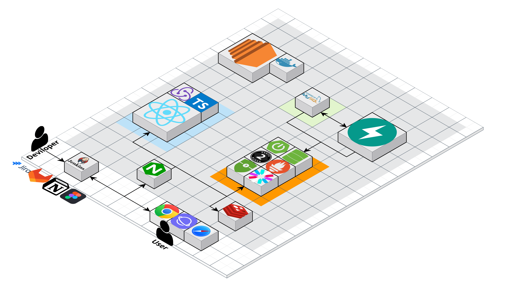

# Coffeebrew

빅데이터 추천 시스템을 이용한 커피 원두 추천 사이트

## 🪔프로젝트 소개

### 📅진행 일정

23.02.20(월) ~ 23.04.07(금) (총 7주)

- 기획 및 설계 : 02.20 ~ 03.10 (3주)
  - 기획 : 프로젝트 아이디어 논의, 주제 구체화, 기술 스택 선정
  - 설계 : 기능 요구 명세서 작성, ERD, 와이어프레임, 프로젝트 구조 설계, REST API 설계
- 개발 : 03.10 ~ 03.31 (3주)
  - API 구현
  - 프로젝트 주요 기능 구현
  - 배포 및 인프라 구축
- 테스트 및 유지보수 : 03.31 ~ 04.07 (1주)
  - 통합 테스트
  - 오류 수정
  - 산출물 정리

## 🤝팀 소개

#### 🌈프론트엔드

| 이름                                                       | 개발 내용                                             |
| ---------------------------------------------------------- | ----------------------------------------------------- |
| [👨🏻‍💻 배상현](https://github.com/{}) [📧](mailto:@gmail.com) | React, 웹사이트 전체 디자인 및 UI/UX 기획   |
| [👨🏻‍💻 유헌상](https://github.com/{}) [📧](mailto:@gmail.com) | React                                                 |
| [👨🏻‍💻 이도겸](https://github.com/{}) [📧](mailto:@gmail.com) | React                                                 |

#### 🛰벡엔드

| 이름                                                       | 개발 내용                                               |
| ---------------------------------------------------------- | ------------------------------------------------------- |
| [👨🏻‍💻 권동규](https://github.com/{}) [📧](mailto:@gmail.com) | 팀장  Fast API, 추천알고리즘 설계                                |
| [👨🏻‍💻 이동훈](https://github.com/{}) [📧](mailto:@gmail.com) | Spring Boot REST API  젠킨스와 도커를 활용한 CI/CD |
| [👨🏻‍💻 한재욱](https://github.com/{}) [📧](mailto:@gmail.com) | Spring Boot REST API  젠킨스와 도커를 활용한 CI/CD |

### 🏁목표

완성도 높은 !!!

### 🤔기획 의도

커피를 즐겨 마시지만, 본인의 커피(원두) 취향을 잘 모르는 일반 사용자들이 추천 시스템을 통해 다양한 커피를 접해보고 본인에게 맞는 커피를 찾아갈 수 있도록 도움을 주기

#### 🎯서비스 대상

커피 취향을 잘모르는 사용자

#### 🎨UI/UX

커피와 어울리는 감성적인 디자인

#### ⚙Technical

##### 📡프론트엔드

Typescript

##### 📡벡엔드

fastapi, 추천알고리즘(collaborative filtering, content based filtering)

## 🛠기술 스택

- 세부내역
  > | 구분     | 기술스택          | 상세내용           | 버전    |
  > | :------- | :---------------- | :----------------- | :------ |
  > | 공통     | 형상관리          | GitLab             | -       |
  > | &nbsp;   | 이슈관리          | Jira               | -       |
  > | &nbsp;   | 커뮤니케이션      | Mattermost         | -       |
  > | FrontEnd | HTML5             |
  > | &nbsp;   | CSS3              |
  > | &nbsp;   | JavaScript(ES6)   |
  > | &nbsp;   | styled-components | Tailwind           | 2.2.0   |
  > | &nbsp;   | React             | React              | 18.2.0  |
  > | &nbsp;   | &nbsp;            | Redux              | 8.0.5   |
  > | &nbsp;   | &nbsp;            | Redux-Toolkit      | 1.9.2   |
  > | &nbsp;   | IDE               | Visual Studio Code | 1.75.1  |
  > | BackEnd  | Java              | OpenJDK            | 11.0.15 |
  > | &nbsp;   | Build             | Gradle             | 7.6.1   |
  > | &nbsp;   | Spring            | Boot               | 2.7.9   |
  > | &nbsp;   | &nbsp;            | Security           | 5.6.1   |
  > | &nbsp;   | API Docs          | Swagger2           | 2.9.2   |
  > | &nbsp;   | DB                | Mysql              | 8.0.32  |
  > | &nbsp;   | &nbsp;            | Spring-Data-jpa    | 2.6.0  |
  > | &nbsp;   | IDE               | IntelliJ           | 22.3.1  |
  > | Server   | AWS EC2           | Ubuntu             | 20.04   |
  > | &nbsp;   | 배포              | Docker             | 23.0.0  |
  > | &nbsp;   | 배포              | Docker-compose     | 23.0.0  |
  > | &nbsp;   | &nbsp;            | Jenkins            | 2.375.2 |
  > | &nbsp;   | WebServer         | Nginx              | 1.23.3  |

### 📬배포 방법

> - [[링크 참조](/exec/1_2_TechStack.md)]

## 💼기획/설계

### 📑기능 요구 명세서
![요구사항 명세서]

### 📑ERD

![ERD]
 

### 🧩와이어프레임

![피그마]

 

## 🛰프로젝트 관리/운영

### 🛰프로젝트 디렉토리

| 🖼프론트엔드                                                                             | 📡백엔드                                                                                |
| --------------------------------------------------------------------------------------- | --------------------------------------------------------------------------------------- |
| ![프론트디렉토리구조] | ![벡엔드디렉토리구조] |

 

### 📢Jira

![지라]

 

## 📱서비스 구현 내용

### 🕹주요 기능

#### 메인페이지 - 커피추천

![커피캡슐, 원두 추천]
 

#### 마이페이지

![마이페이지]
 
