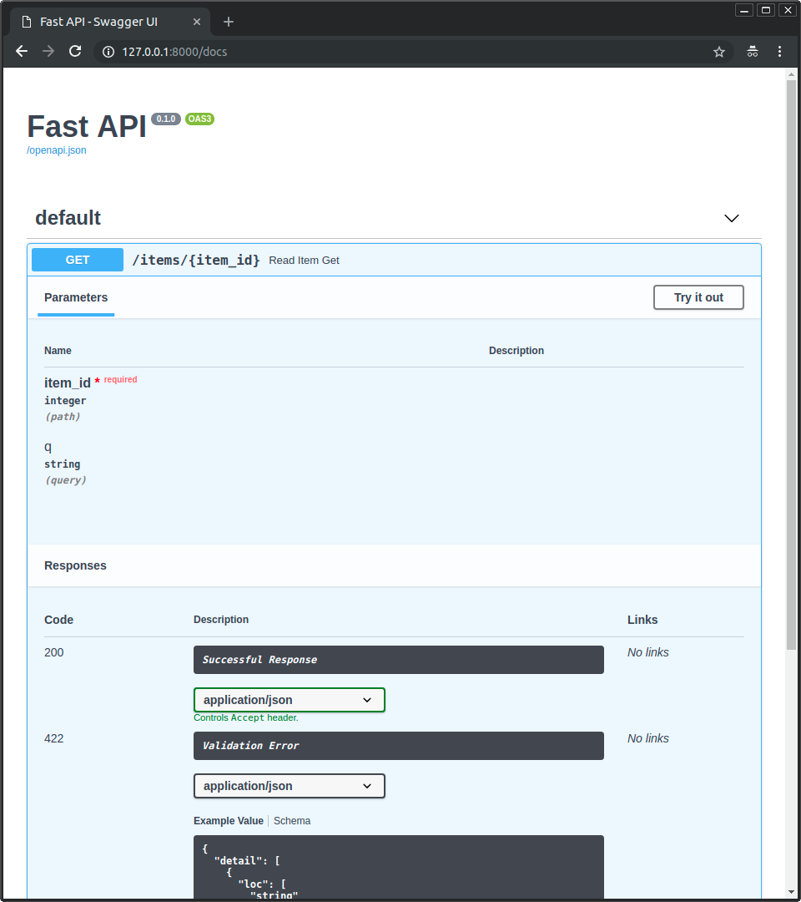

# FastAPI

## 목차

1. [FastAPI란?](#1-fastapi란)
2. [FastAPI 설치](#2-fastapi-설치)
3. [FastAPI 예제](#3-fastapi-예제)
4. [FastAPI 예제로 기초 설명](#4-fastapi-예제로-기초-설명)

## 1. FastAPI란?


_FastAPI 프레임워크, 고성능, 간편한 학습, 빠른 코드 작성, 준비된 프로덕션_

FastAPI는 현대적이고, 빠르며(고성능), 파이썬 표준 타입 힌트에 기초한 Python3.7+의 API를 빌드하기 위한 웹 프레임워크이다.

### FastAPI 특징

- **빠름**: (Starlette과 Pydantic 덕분에) **NodeJS** 및 **Go**와 대등할 정도로 매우 높은 성능. 사용 가능한 가장 빠른 파이썬 프레임워크 중 하나
- **빠른 코드 작성**: 약 200%에서 300%까지 기능 개발 속도 증가
- **적은 버그**: 사람(개발자)에 의한 에러 약 40% 감소
- **직관적**: 훌륭한 편집기 지원. 모든 곳에서 자동완성 지원. 적은 디버깅 시간
- **쉬움**: 쉽게 사용하고 배우도록 설계. 적은 문서 읽기 시간
- **짧음**: 코드 중복 최소화. 각 매개변수 선언의 여러 기능. 적은 버그
- **견고함**: 준비된 프로덕션 용 코드를 얻으십시오. 자동 대화형 문서와 함께
- **표준 기반**: API에 대한 (완전히 호환되는) 개방형 표준 기반: [OpenAPI](https://github.com/OAI/OpenAPI-Specification)및 [JSON 스키마](http://json-schema.org/)

### 요구사항

- Python 3.7+
- FastAPI는 다음 두개의 모듈의 영향을 크게 받는다. 필요할시 설치를 요구합니다.
  - 웹 부분을 위한 [**Starlette**](https://www.starlette.io/)
  - 데이터 부분을 위한 [**Pydantic**](https://pydantic-docs.helpmanual.io/)

## 2. FastAPI 설치

모든 선택적 의존성을 포함하여 설치

```bash
pip install "fastapi[all]"
```

필요한 모듈을 부분적으로 설치

```bash
# fastapi 모듈
pip install fastapi

# 서버 역할을 해주는 uvicorn 모듈
pip install uvicorn
```

## 3. FastAPI 예제

### FastAPI 실행

```python
# main.py

from fastapi import FastAPI

app = FastAPI()

@app.get("/")
async def root():
    return {"message": "Hello World"}
```

위 코드를 uvicorn 라이브 서버로 실행

```bash
uvicorn main:app --reload

INFO:     Uvicorn running on http://127.0.0.1:8000 (Press CTRL+C to quit)
INFO:     Started reloader process [28720]
INFO:     Started server process [28722]
INFO:     Waiting for application startup.
INFO:     Application startup complete.
```

> `uvicorn main:app` 명령은 다음을 의미한다
>
> - `main`: 파일 `main.py` (파이썬 "모듈")
> - `app`: `main.py` 내부의 `app = FastAPI()` 줄에서 생성한 오브젝트
> - `-reload`: 코드 변경 후 서버 재시작. 개발에만 사용

브라우저로 [http://127.0.0.1:8000](http://127.0.0.1:8000/)를 열면 `{"message": "Hello World"}`라는 JSON 응답을 볼 수 있다.

### 대화형 API 문서 보기

FastAPI는 선언된 모든 API를 Swagger를 통한 대화형 API로 자동 생성해준다.

브라우저로 [http://127.0.0.1:8000/docs](http://127.0.0.1:8000/docs)를 열어 대화형 인터페이스로 API 테스트를 해볼 수 있다.



### OPEN API 스키마 확인하기

FastAPI는 OpenAPI \*\*\*\*표준을 사용하여 여러분의 모든 API를 이용해 스키마를 생성한다.

가공되지 않은 OpenAPI 스키마를 FastAPI는 자동으로 API의 설명과 함께 JSON (스키마)를 생성한다.

브라우저에서 [http://127.0.0.1:8000/openapi.json](http://127.0.0.1:8000/openapi.json)를 열어 확인해 볼 수 있다.

```json
{
    "openapi": "3.0.2",
    "info": {
        "title": "FastAPI",
        "version": "0.1.0"
    },
    "paths": {
        "/items/": {
            "get": {
                "responses": {
                    "200": {
                        "description": "Successful Response",
                        "content": {
                            "application/json": {

...

}
```

## 4. FastAPI 예제로 기초 설명

### 1) FastAPI 임포트

```python
from fastapi import FastAPI
```

FastAPI는 API에 대한 모든 기능을 제공하는 파이썬 클래스입니다.

**기술 세부사항**

FastAPI는 Starlette를 직접 상속하는 클래스이며, [Starlette](https://www.starlette.io/)의 모든 기능을 사용할 수 있다.

### 2) FastAPI Instance 생성

```python
app = FastAPI()
```

`app` 변수는 FastAPI 클래스의 Instance가 된다.

이것은 모든 API를 생성하기 위한 상호작용의 엔트리 포인트가 될 것이다.

**Instance 이름에 따른 uvicorn 실행**

이 `app`은 다음 명령에서 `uvicorn`이 참조하고 것과 동일하다.

```bash
uvicorn main:app --reload
```

`my_awesome_api = FastAPI()`처럼 인스턴스를 선언했다면 `uvicorn`을 아래처럼 호출하면 된다.

```bash
uvicorn main:my_awesome_api --reload
```

### 3) path operation 생성

**경로(Path)**

경로(path)는 일반적으로 엔드드포인트(endpoint) 또는 route(라우트)라고도 불립니다.

API를 설계할 때 경로는 관심사(concerns)와 자원(resources)를 분리하는 주요 방법이다.

여기서 경로는 첫 번째 `/`에서 시작하는 URL의 마지막 부분을 나타낸다.

그러므로 `https://example.com/items/foo`와 같은 URL에서 경로는 `/items/foo`와 같다.

**동작(Operation)**

여기서 동작(Operation)은 HTTP 메소드 중 하나를 나타냅니다.

HTTP 프로토콜에서는 이러한 메소드를 하나(또는 이상) 사용하여 각 경로와 통신할 수 있다.

HTTP Method의 종류

- `POST`: 데이터 생성
- `GET`: 데이터 읽기
- `PUT`: 데이터 업데이트
- `DELETE`: 데이터 삭제
- `OPTIONS`
- `HEAD`
- `PATCH`
- `TRACE`

### 경로 동작 데코레이터

```python
@app.get("/")
async def root():
    return {"message": "Hello World"}
```

`@app.get("/")`은 FastAPI에게 아래에 있는 함수가 경로 `/`로 `get`요청이 들어오면 수행하도록 알려주는 데코레이터(decorator)이다.

**`@decorator` 정보**

`@something` 문법은 파이썬에서 데코레이터(decorator)라 한다.

적용하고자 하는 함수 맨 위에 놓으며, 데코레이터 아래 있는 함수를 받고 그걸 이용해 미리 지정된 동작(something)을 한다.

FastAPI의 경우, 해당 데코레이터는 FastAPI에게 아래 함수가 경로에 해당하는 동작하라고 알려준다.

이것을 "**경로 동작 데코레이터(path operation decorator)**"라고 부른다.

경로 동작 데코레이터는 HTTP Method와 대응하며, 종류는 다음과 같다.

- `@app.post()`
- `@app.put()`
- `@app.delete()`
- `@app.options()`
- `@app.head()`
- `@app.patch()`
- `@app.trace()`

### 4) 경로 동작 함수

```python
async def root():
    return {"message": "Hello World"}
```

`GET` 동작을 사용하여 URL "`/`"에 대한 요청을 받을 때마다 FastAPI에 의해 호출된다.

또는, `async def` 대신 일반 함수로 정의할 수 있다.

```python
from fastapi import FastAPI

app = FastAPI()

@app.get("/")
def root():
    return {"message": "Hello World"}
```

**Note**

일반 메소드와 `async` 메소드의 차이점은 [Async: *"In a hurry?"*](https://fastapi.tiangolo.com/ko/async/#in-a-hurry)을 참고

### 5) 콘텐츠 반환

```python
from fastapi import FastAPI

app = FastAPI()

@app.get("/")
async def root():
    return {"message": "Hello World"} # <-here
```

`dict`, `list`, 단일값을 가진 `str`, `int` 등 을 반환할 수 있다.

또는 Pydantic 모델을 반환할 수도 있다.

대부분의 객체와 모델(ORM 등을 포함)은 JSON으로 자동 변환된다.
